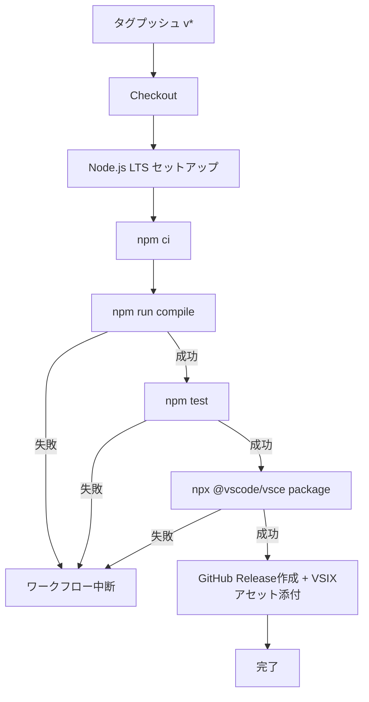

# デザインドキュメント: github-actions-vsix-release

## 概要

PrefixFold拡張機能に、GitHubへのタグプッシュをトリガーとしたCI/CDパイプラインを追加する。`v`プレフィックス付きタグ（例: `v0.1.0`）のプッシュを検知し、TypeScriptのコンパイル・テスト実行・VSIXパッケージ生成・GitHub Release作成までを自動化する単一のGitHub Actionsワークフローを`.github/workflows/release.yml`に定義する。

### 設計方針

1. **単一ワークフロー・単一ジョブ**: リリースプロセスの全ステップ（ビルド→テスト→パッケージ→リリース）を1つのジョブ内で順次実行し、シンプルさを維持する
2. **最小権限の原則**: ワークフローに付与する権限は`contents: write`のみとし、GitHub Release作成とアセットアップロードに必要な最小限に留める
3. **npx経由のツール実行**: vsceをグローバルインストールせず`npx @vscode/vsce`で実行し、ワークフローの再現性を確保する
4. **フェイルファスト**: コンパイルエラーやテスト失敗が発生した時点でワークフローを中断し、不完全な成果物がリリースされることを防ぐ

### リサーチ結果の要約

- **softprops/action-gh-release**: GitHub Release作成用の広く使われているアクション（5.1k+ stars）。`v2`がNode 20対応の安定版。`files`パラメータでリリースアセットを添付でき、`generate_release_notes: true`でGitHubの自動リリースノート生成機能を利用可能（[softprops/action-gh-release](https://github.com/softprops/action-gh-release)）
- **actions/setup-node**: GitHub公式のNode.jsセットアップアクション。`v4`が最新安定版で、`node-version`に`'lts/*'`を指定することでLTSバージョンを自動選択できる（[actions/setup-node](https://github.com/actions/setup-node)）
- **actions/checkout**: GitHub公式のリポジトリチェックアウトアクション。`v4`が最新安定版（[actions/checkout](https://github.com/actions/checkout)）
- **@vscode/vsce**: VSCode拡張機能のパッケージングCLIツール。`npx @vscode/vsce package`でVSIXファイルを生成できる。`--out`オプションで出力ファイル名を指定可能

## アーキテクチャ

### ワークフロー全体構成

```
┌─────────────────────────────────────────────────────────┐
│  GitHub リポジトリ                                        │
│                                                         │
│  git tag v0.1.0 && git push --tags                      │
│       │                                                 │
│       ▼                                                 │
│  ┌─────────────────────────────────────────────────┐    │
│  │  GitHub Actions: release.yml                     │    │
│  │  トリガー: push tags: ["v*"]                      │    │
│  │                                                  │    │
│  │  ┌───────────────────────────────────────────┐   │    │
│  │  │  Job: release (ubuntu-latest)              │   │    │
│  │  │                                            │   │    │
│  │  │  1. actions/checkout@v4                    │   │    │
│  │  │       │                                    │   │    │
│  │  │       ▼                                    │   │    │
│  │  │  2. actions/setup-node@v4 (LTS)           │   │    │
│  │  │       │                                    │   │    │
│  │  │       ▼                                    │   │    │
│  │  │  3. npm ci                                 │   │    │
│  │  │       │                                    │   │    │
│  │  │       ▼                                    │   │    │
│  │  │  4. npm run compile                        │   │    │
│  │  │       │                                    │   │    │
│  │  │       ▼                                    │   │    │
│  │  │  5. npm test                               │   │    │
│  │  │       │                                    │   │    │
│  │  │       ▼                                    │   │    │
│  │  │  6. npx @vscode/vsce package               │   │    │
│  │  │       │  → prefix-fold-{version}.vsix      │   │    │
│  │  │       ▼                                    │   │    │
│  │  │  7. softprops/action-gh-release@v2         │   │    │
│  │  │       → GitHub Release + VSIXアセット添付   │   │    │
│  │  └───────────────────────────────────────────┘   │    │
│  └─────────────────────────────────────────────────┘    │
└─────────────────────────────────────────────────────────┘
```

### フェイルファストフロー



## コンポーネントとインターフェース

### 1. ワークフローファイル (`.github/workflows/release.yml`)

リリースパイプライン全体を定義する唯一のファイル。

#### トリガー設定

```yaml
on:
  push:
    tags:
      - "v*"
```

- `v`で始まるタグのプッシュのみでワークフローが起動する
- ブランチへの通常プッシュや`v`以外のタグでは起動しない

#### 権限設定

```yaml
permissions:
  contents: write
```

- GitHub Release作成とアセットアップロードに必要な最小権限のみを付与
- デフォルトの`GITHUB_TOKEN`権限を明示的に制限する

#### ジョブ定義

単一ジョブ`release`で全ステップを順次実行する。

### 2. チェックアウトステップ

```yaml
- uses: actions/checkout@v4
```

- リポジトリのソースコードをワークスペースにチェックアウトする

### 3. Node.jsセットアップステップ

```yaml
- uses: actions/setup-node@v4
  with:
    node-version: "lts/*"
    cache: "npm"
```

- `lts/*`でNode.jsの最新LTSバージョンを自動選択
- `cache: "npm"`でnpmキャッシュを有効化し、依存関係インストールを高速化

### 4. 依存関係インストールステップ

```yaml
- run: npm ci
```

- `npm ci`で`package-lock.json`に基づいた再現可能なインストールを実行
- `npm install`ではなく`npm ci`を使用し、ロックファイルとの整合性を保証

### 5. コンパイルステップ

```yaml
- run: npm run compile
```

- TypeScriptコンパイラ（`tsc`）を実行し、`src/`→`out/`にトランスパイル
- コンパイルエラーがある場合、このステップで失敗しワークフローが中断される

### 6. テストステップ

```yaml
- run: npm test
```

- Vitest（`vitest run`）でテストスイートを実行
- テスト失敗がある場合、このステップで失敗しワークフローが中断される

### 7. バージョン抽出ステップ

```yaml
- name: Extract version from tag
  id: version
  run: echo "VERSION=${GITHUB_REF_NAME#v}" >> "$GITHUB_OUTPUT"
```

- `GITHUB_REF_NAME`（例: `v0.1.0`）から`v`プレフィックスを除去してバージョン番号を抽出
- 後続ステップで`${{ steps.version.outputs.VERSION }}`として参照可能

### 8. VSIXパッケージ生成ステップ

```yaml
- name: Package VSIX
  run: npx @vscode/vsce package --out prefix-fold-${{ steps.version.outputs.VERSION }}.vsix
```

- `npx`経由で`@vscode/vsce`を実行し、グローバルインストールを回避
- `--out`オプションで出力ファイル名を`prefix-fold-{バージョン}.vsix`形式に指定
- パッケージ生成に失敗した場合、このステップで失敗しワークフローが中断される

### 9. GitHub Releaseステップ

```yaml
- name: Create GitHub Release
  uses: softprops/action-gh-release@v2
  with:
    files: prefix-fold-${{ steps.version.outputs.VERSION }}.vsix
    generate_release_notes: true
```

- `softprops/action-gh-release@v2`を使用してGitHub Releaseを作成
- `files`パラメータで生成したVSIXファイルをリリースアセットとして添付
- `generate_release_notes: true`でGitHubの自動リリースノート生成機能を利用し、前回タグからのコミット履歴に基づくリリースノートを生成
- リリースタイトルはデフォルトでタグ名（例: `v0.1.0`）が使用される

## データモデル

本機能はGitHub Actionsワークフロー定義（YAML）のみで構成され、アプリケーション内のデータモデルは追加しない。

### ワークフロー内で使用される主要な変数

| 変数 | 説明 | 例 |
|------|------|-----|
| `GITHUB_REF_NAME` | プッシュされたタグ名 | `v0.1.0` |
| `steps.version.outputs.VERSION` | `v`プレフィックスを除去したバージョン番号 | `0.1.0` |
| VSIXファイル名 | `prefix-fold-{VERSION}.vsix` | `prefix-fold-0.1.0.vsix` |

### ワークフローYAMLの完全な構造

```yaml
name: Release

on:
  push:
    tags:
      - "v*"

permissions:
  contents: write

jobs:
  release:
    runs-on: ubuntu-latest
    steps:
      - uses: actions/checkout@v4

      - uses: actions/setup-node@v4
        with:
          node-version: "lts/*"
          cache: "npm"

      - name: Install dependencies
        run: npm ci

      - name: Compile
        run: npm run compile

      - name: Test
        run: npm test

      - name: Extract version from tag
        id: version
        run: echo "VERSION=${GITHUB_REF_NAME#v}" >> "$GITHUB_OUTPUT"

      - name: Package VSIX
        run: npx @vscode/vsce package --out prefix-fold-${{ steps.version.outputs.VERSION }}.vsix

      - name: Create GitHub Release
        uses: softprops/action-gh-release@v2
        with:
          files: prefix-fold-${{ steps.version.outputs.VERSION }}.vsix
          generate_release_notes: true
```

## エラーハンドリング

### ステップ別のエラー対応

GitHub Actionsはデフォルトでフェイルファスト動作を行う。各ステップが失敗した場合、後続ステップは実行されずワークフロー全体が失敗として終了する。

| ステップ | 失敗原因 | 結果 | 要件 |
|---------|---------|------|------|
| `npm ci` | `package-lock.json`との不整合、ネットワークエラー | ワークフロー中断、ビルド以降のステップは実行されない | 2.1 |
| `npm run compile` | TypeScriptコンパイルエラー | ワークフロー中断、テスト以降のステップは実行されない | 2.2, 2.4 |
| `npm test` | テスト失敗 | ワークフロー中断、VSIX生成以降のステップは実行されない | 2.3, 2.4 |
| `npx @vscode/vsce package` | パッケージ生成エラー（不正なpackage.jsonなど） | ワークフロー中断、GitHub Release作成は実行されない | 3.1, 3.3 |
| `softprops/action-gh-release` | 権限不足、ネットワークエラー | ワークフロー失敗として記録される | 4.1 |

### エラー通知

- GitHub Actionsのデフォルト通知機能により、ワークフロー失敗時にリポジトリのWatch設定に基づいてメール通知が送信される
- ワークフローの実行ログはGitHub UIの「Actions」タブから確認可能

### バージョン抽出の堅牢性

- `GITHUB_REF_NAME`はGitHub Actionsが提供する環境変数で、タグプッシュ時には常にタグ名が設定される
- `${GITHUB_REF_NAME#v}`はシェルのパラメータ展開で、`v`プレフィックスが存在しない場合でも安全に動作する（元の文字列がそのまま返される）
- ただし、トリガー条件`tags: ["v*"]`により、`v`で始まるタグのみがワークフローを起動するため、`v`プレフィックスは常に存在する

## テスト戦略

### PBTの適用判断

本機能はGitHub Actionsワークフロー定義（YAML設定ファイル）であり、プロパティベーステストの対象外である。理由は以下の通り:

- **宣言的な設定**: ワークフローYAMLは入力/出力を持つ関数ではなく、CI/CDパイプラインの宣言的な定義である
- **外部サービス依存**: 実行はGitHub Actionsランタイムに完全に依存し、ローカルでの反復テストが不可能
- **入力空間が限定的**: トリガーはタグプッシュイベントのみで、多様な入力に対する普遍的性質を検証する意味がない

そのため、正当性プロパティセクションは省略し、以下のテスト手法を採用する。

### テスト手法

#### 1. YAMLバリデーション（静的検証）

ワークフローYAMLの構文と構造を検証する。

- **対象**: `.github/workflows/release.yml`
- **手法**: `actionlint`やGitHub ActionsのYAMLスキーマバリデーションを活用
- **検証項目**:
  - YAML構文の正当性
  - アクションのバージョン指定が正しいこと
  - 必須フィールドが存在すること

#### 2. 手動テスト（E2Eテスト）

実際のGitHubリポジトリでタグプッシュを行い、ワークフロー全体の動作を確認する。

| テストケース | 手順 | 期待結果 | 要件 |
|-------------|------|---------|------|
| 正常系: vタグプッシュ | `git tag v0.0.1-test && git push --tags` | ワークフロー起動→ビルド→テスト→VSIX生成→Release作成 | 1.1, 2.1-2.3, 3.1-3.2, 4.1-4.4 |
| 非vタグ | `git tag test-tag && git push --tags` | ワークフローが起動しない | 1.2 |
| ブランチプッシュ | `git push origin feature-branch` | ワークフローが起動しない | 1.3 |
| コンパイルエラー | コンパイルエラーを含むコードでタグプッシュ | ワークフロー中断、VSIX未生成 | 2.4 |
| テスト失敗 | テスト失敗を含むコードでタグプッシュ | ワークフロー中断、VSIX未生成 | 2.4 |

#### 3. 構成確認（スモークテスト）

ワークフローファイルの内容を目視またはスクリプトで確認する。

| 確認項目 | 期待値 | 要件 |
|---------|--------|------|
| ファイルパス | `.github/workflows/release.yml` | 5.1 |
| 実行環境 | `ubuntu-latest` | 5.2 |
| Node.jsバージョン | `lts/*` | 5.3 |
| 権限設定 | `contents: write`のみ | 5.4 |
| vsce実行方法 | `npx @vscode/vsce` | 5.5 |

### テスト対象の分類まとめ

| 分類 | 要件 | テスト手法 |
|------|------|-----------|
| SMOKE | 5.1, 5.2, 5.3, 5.4, 5.5 | 構成確認（ファイル内容の検証） |
| INTEGRATION | 1.1, 2.1, 2.2, 2.3, 3.1, 3.2, 4.1, 4.2, 4.3, 4.4 | 手動E2Eテスト（実際のタグプッシュ） |
| EXAMPLE | 1.2, 1.3, 2.4, 3.3 | 手動テスト（異常系シナリオ） |
